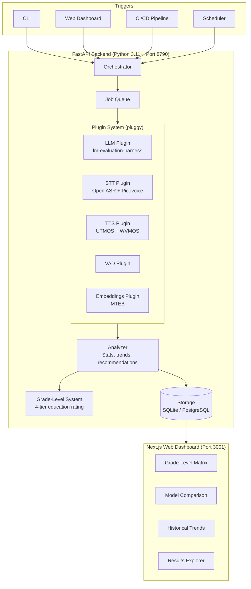

# UnaMentis Voice Learning AI Eval Suite

**A unified, open-source system for evaluating AI models in the context of educational voice interaction.**

Repo: `edu-voice-ai-eval`

## Vision

When building voice-based educational AI, choosing the right models for speech-to-text, text-to-speech, and language understanding is critical, and the landscape changes constantly. This project provides a single, cohesive system to evaluate open-source models across all three modalities, with education-specific benchmarks that tell you not just how good a model is in general, but what grade level of content it can handle reliably.

Whether you're comparing on-device models for a mobile tutoring app or selecting server-side models for a conversational learning platform, this tool gives you repeatable, shareable evaluations with a rich web interface for exploring results.

## Key Capabilities

1. **LLM Grade-Level Evaluation**: Rate language models on a four-tier education scale (Elementary through Graduate) using MMLU subject mapping, TutorBench, and OpenLearnLM benchmarks
2. **STT Domain Accuracy**: Evaluate speech-to-text models on standard benchmarks plus custom educational vocabulary (can the model transcribe "stoichiometry" and "Pythagorean" correctly?)
3. **TTS Quality Assessment**: Score text-to-speech models on naturalness (UTMOS/WVMOS), pronunciation accuracy on academic terms, and intelligibility through STT round-trip testing

## Architecture Overview



## Built On the Shoulders of Giants

This project integrates and orchestrates outstanding work from the open-source community:

| Project | Role | License |
|---------|------|---------|
| [EleutherAI lm-evaluation-harness](https://github.com/EleutherAI/lm-evaluation-harness) | Core LLM benchmarking engine | MIT |
| [HuggingFace Open ASR Leaderboard](https://github.com/huggingface/open_asr_leaderboard) | STT evaluation framework | Apache 2.0 |
| [Picovoice STT Benchmark](https://github.com/Picovoice/speech-to-text-benchmark) | On-device STT metrics | Apache 2.0 |
| [UTMOS](https://github.com/sarulab-speech/UTMOS22) | Automated MOS scoring | MIT |
| [WVMOS](https://github.com/AndreevP/wvmos) | Wav2Vec MOS prediction | MIT |
| [OpenLearnLM](https://arxiv.org/abs/2601.13882) | Education-specific LLM benchmark | Open |
| [TutorBench](https://arxiv.org/abs/2510.02663) | Tutoring capability assessment | Open |

See [ATTRIBUTION.md](ATTRIBUTION.md) for complete credits.

## Documentation

| Document | Description |
|----------|-------------|
| **Architecture** | |
| [System Overview](architecture/OVERVIEW.md) | Full architecture with component diagrams |
| [Data Model](architecture/DATA_MODEL.md) | Database schema and Python/TypeScript types |
| [Plugin System](architecture/PLUGIN_SYSTEM.md) | Evaluation backend plugin architecture |
| [Web Dashboard](architecture/WEB_DASHBOARD.md) | UI design with wireframes for all 9 pages |
| [CLI Design](architecture/CLI_DESIGN.md) | Command-line interface specification |
| [API Design](architecture/API_DESIGN.md) | REST API endpoint specification |
| [Integration Points](architecture/INTEGRATION_POINTS.md) | Upstream tool integration details |
| **Benchmarks** | |
| [Grade-Level System](benchmarks/GRADE_LEVEL_SYSTEM.md) | 4-tier education capability rating |
| [LLM Benchmarks](benchmarks/LLM_BENCHMARKS.md) | Language model evaluation methodology |
| [STT Benchmarks](benchmarks/STT_BENCHMARKS.md) | Speech-to-text evaluation methodology |
| [TTS Benchmarks](benchmarks/TTS_BENCHMARKS.md) | Text-to-speech evaluation methodology |
| **Implementation** | |
| [Roadmap](implementation/ROADMAP.md) | 5-phase implementation plan |
| [Tech Stack](implementation/TECH_STACK.md) | Technology decisions with rationale |
| [Project Structure](implementation/PROJECT_STRUCTURE.md) | Complete repo layout |
| **Reference** | |
| [Research](reference/RESEARCH.md) | Original research and literature review |

## Quick Start (Preview)

Once implemented, the system will work like this:

```bash
# Install
pip install edu-voice-ai-eval

# Evaluate a model on education benchmarks
voicelearn-eval run --model Qwen/Qwen2.5-3B-Instruct --suite education_focus

# Check what grade level the model can handle
voicelearn-eval grade --model Qwen/Qwen2.5-3B-Instruct

# Compare two models
voicelearn-eval compare --models Qwen2.5-3B Ministral-3B --benchmarks edu_tier1 edu_tier2

# Launch the web dashboard
voicelearn-eval serve
# Open http://localhost:3001
```

## License

MIT (to be confirmed at repo creation)
