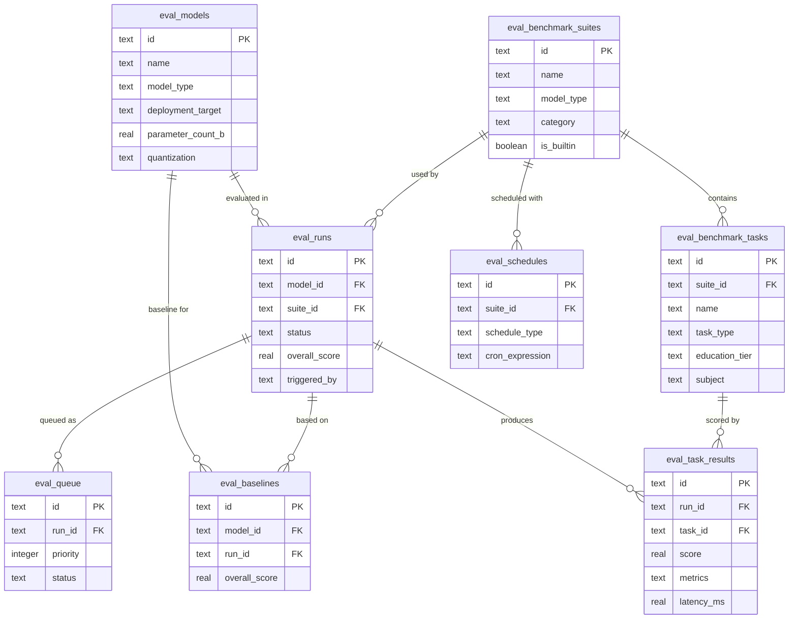

# Data Model

This document defines the complete data model for the evaluation system, including the database schema, Python dataclass definitions, and TypeScript types for the web frontend.

## Database Schema

SQLite-compatible with PostgreSQL extensions noted. JSON columns store flexible metric payloads while indexed columns support fast filtering.

### eval_models

Registered models available for evaluation.

```sql
CREATE TABLE eval_models (
    id TEXT PRIMARY KEY,
    name TEXT NOT NULL,
    slug TEXT NOT NULL UNIQUE,
    model_type TEXT NOT NULL,                 -- 'llm' | 'stt' | 'tts' | 'vad' | 'embeddings'
    model_family TEXT,                        -- e.g. "qwen", "whisper", "piper"
    model_version TEXT,                       -- e.g. "2.5", "v3"

    -- Source and access
    source_type TEXT NOT NULL,                -- 'huggingface' | 'local' | 'api' | 'ollama'
    source_uri TEXT,                          -- HF repo id, local path, or API endpoint
    source_format TEXT,                       -- 'gguf' | 'onnx' | 'safetensors' | 'api' | 'coreml'
    api_base_url TEXT,                        -- For API-type models
    api_key_env TEXT,                         -- Env var name for API key (never store raw keys)

    -- Deployment metadata
    deployment_target TEXT NOT NULL DEFAULT 'server',
                                              -- 'on-device' | 'server' | 'cloud-api'
    parameter_count_b REAL,                   -- Billions of parameters
    model_size_gb REAL,                       -- Disk size in GB
    quantization TEXT,                        -- 'Q4_K_M', 'INT8', 'FP16', etc.
    context_window INTEGER,                   -- Max context for LLMs

    -- Educational suitability metadata
    education_tiers TEXT,                     -- JSON array: ["elementary","highschool","undergrad","grad"]
    subjects TEXT,                            -- JSON array: ["math","science","history","cs"]
    languages TEXT,                           -- JSON array: ["en","es","fr","zh"]

    -- Tags and notes
    tags TEXT,                                -- JSON array of arbitrary tags
    notes TEXT,

    -- Tracking
    is_reference BOOLEAN DEFAULT FALSE,       -- Reference/baseline model (e.g. GPT-4)
    is_active BOOLEAN DEFAULT TRUE,           -- Soft delete
    created_at TEXT NOT NULL DEFAULT (datetime('now')),
    updated_at TEXT NOT NULL DEFAULT (datetime('now'))
);

CREATE INDEX idx_eval_models_type ON eval_models(model_type);
CREATE INDEX idx_eval_models_family ON eval_models(model_family);
CREATE INDEX idx_eval_models_source ON eval_models(source_type);
CREATE INDEX idx_eval_models_deployment ON eval_models(deployment_target);
```

### eval_benchmark_suites

Collections of evaluation tasks.

```sql
CREATE TABLE eval_benchmark_suites (
    id TEXT PRIMARY KEY,
    name TEXT NOT NULL,
    slug TEXT NOT NULL UNIQUE,
    description TEXT,
    model_type TEXT NOT NULL,                 -- 'llm' | 'stt' | 'tts'

    -- Configuration
    config TEXT NOT NULL,                     -- JSON: full suite config (tasks, settings)
    default_params TEXT,                      -- JSON: default run parameters

    -- Metadata
    category TEXT,                            -- 'quality' | 'performance' | 'education' | 'safety'
    is_builtin BOOLEAN DEFAULT FALSE,
    is_active BOOLEAN DEFAULT TRUE,
    created_by TEXT,

    created_at TEXT NOT NULL DEFAULT (datetime('now')),
    updated_at TEXT NOT NULL DEFAULT (datetime('now'))
);

CREATE INDEX idx_eval_suites_type ON eval_benchmark_suites(model_type);
```

### eval_benchmark_tasks

Individual evaluation tasks within a suite.

```sql
CREATE TABLE eval_benchmark_tasks (
    id TEXT PRIMARY KEY,
    suite_id TEXT NOT NULL REFERENCES eval_benchmark_suites(id) ON DELETE CASCADE,
    name TEXT NOT NULL,
    description TEXT,
    task_type TEXT NOT NULL,                  -- 'mmlu' | 'wer' | 'mos' | 'tutoring' | 'custom'

    -- Task configuration
    config TEXT NOT NULL,                     -- JSON: task-specific config
    weight REAL DEFAULT 1.0,                  -- Weight in aggregate scoring

    -- Educational context
    education_tier TEXT,                      -- 'elementary' | 'highschool' | 'undergrad' | 'grad'
    subject TEXT,                             -- e.g. "biology", "computer_science"

    order_index INTEGER DEFAULT 0,
    created_at TEXT NOT NULL DEFAULT (datetime('now'))
);

CREATE INDEX idx_eval_tasks_suite ON eval_benchmark_tasks(suite_id);
CREATE INDEX idx_eval_tasks_tier ON eval_benchmark_tasks(education_tier);
```

### eval_runs

Execution of a model against a benchmark suite.

```sql
CREATE TABLE eval_runs (
    id TEXT PRIMARY KEY,
    model_id TEXT NOT NULL REFERENCES eval_models(id),
    suite_id TEXT NOT NULL REFERENCES eval_benchmark_suites(id),

    -- Run configuration
    run_config TEXT,                          -- JSON: runtime config overrides
    run_params TEXT,                          -- JSON: inference params (temp, top_p, etc.)

    -- Status tracking
    status TEXT NOT NULL DEFAULT 'pending',   -- 'pending' | 'queued' | 'running' |
                                              -- 'completed' | 'failed' | 'cancelled'
    progress_percent REAL DEFAULT 0,
    current_task TEXT,
    tasks_completed INTEGER DEFAULT 0,
    tasks_total INTEGER DEFAULT 0,

    -- Timing
    queued_at TEXT,
    started_at TEXT,
    completed_at TEXT,

    -- Results summary (denormalized for fast queries)
    overall_score REAL,
    overall_metrics TEXT,                     -- JSON: summary metrics blob

    -- Execution context
    hardware_info TEXT,                       -- JSON: GPU, CPU, RAM, etc.
    software_info TEXT,                       -- JSON: framework versions, OS
    error_message TEXT,
    error_traceback TEXT,

    -- Scheduling
    schedule_id TEXT,
    triggered_by TEXT DEFAULT 'manual',       -- 'manual' | 'schedule' | 'webhook' | 'import'

    -- Version tracking (for re-runs)
    run_version INTEGER DEFAULT 1,

    created_at TEXT NOT NULL DEFAULT (datetime('now')),
    updated_at TEXT NOT NULL DEFAULT (datetime('now'))
);

CREATE INDEX idx_eval_runs_model ON eval_runs(model_id);
CREATE INDEX idx_eval_runs_suite ON eval_runs(suite_id);
CREATE INDEX idx_eval_runs_status ON eval_runs(status);
CREATE INDEX idx_eval_runs_created ON eval_runs(created_at DESC);
CREATE INDEX idx_eval_runs_model_suite ON eval_runs(model_id, suite_id);
```

### eval_task_results

Per-task results within an evaluation run.

```sql
CREATE TABLE eval_task_results (
    id TEXT PRIMARY KEY,
    run_id TEXT NOT NULL REFERENCES eval_runs(id) ON DELETE CASCADE,
    task_id TEXT NOT NULL REFERENCES eval_benchmark_tasks(id),

    -- Core metrics
    score REAL,                               -- Primary score (0-100 normalized)
    raw_score REAL,                           -- Raw metric value (e.g. WER, MOS, accuracy)
    raw_metric_name TEXT,                     -- What the raw metric represents

    -- Detailed metrics (flexible JSON)
    metrics TEXT,                             -- JSON: all metrics for this task
    -- LLM: {"accuracy": 0.85, "f1": 0.82, "exact_match": 0.78}
    -- STT: {"wer": 0.05, "cer": 0.02, "rtfx": 0.3, "latency_ms": 150}
    -- TTS: {"mos_utmos": 4.2, "mos_wvmos": 3.9, "intelligibility_wer": 0.03}

    -- Performance metrics (measured during execution)
    latency_ms REAL,
    throughput REAL,                           -- Tokens/sec for LLM, RTFx for STT/TTS
    memory_peak_mb REAL,
    gpu_memory_peak_mb REAL,

    -- Audio samples (TTS evaluations)
    sample_audio_path TEXT,
    sample_text TEXT,

    -- Error tracking
    status TEXT DEFAULT 'completed',          -- 'completed' | 'failed' | 'skipped'
    error_message TEXT,

    -- Timing
    started_at TEXT,
    completed_at TEXT,
    duration_seconds REAL,

    created_at TEXT NOT NULL DEFAULT (datetime('now'))
);

CREATE INDEX idx_eval_task_results_run ON eval_task_results(run_id);
CREATE INDEX idx_eval_task_results_task ON eval_task_results(task_id);
CREATE INDEX idx_eval_task_results_score ON eval_task_results(score);
```

### eval_baselines

Reference points for comparison and regression detection.

```sql
CREATE TABLE eval_baselines (
    id TEXT PRIMARY KEY,
    name TEXT NOT NULL,
    description TEXT,

    model_id TEXT NOT NULL REFERENCES eval_models(id),
    run_id TEXT NOT NULL REFERENCES eval_runs(id),
    suite_id TEXT NOT NULL REFERENCES eval_benchmark_suites(id),

    overall_score REAL NOT NULL,
    task_scores TEXT NOT NULL,                -- JSON: {task_id: score}

    is_active BOOLEAN DEFAULT TRUE,
    created_at TEXT NOT NULL DEFAULT (datetime('now'))
);

CREATE INDEX idx_eval_baselines_model ON eval_baselines(model_id);
CREATE INDEX idx_eval_baselines_suite ON eval_baselines(suite_id);
CREATE INDEX idx_eval_baselines_active ON eval_baselines(is_active);
```

### eval_custom_test_sets

User-created educational content for evaluation.

```sql
CREATE TABLE eval_custom_test_sets (
    id TEXT PRIMARY KEY,
    name TEXT NOT NULL,
    description TEXT,
    model_type TEXT NOT NULL,                 -- 'llm' | 'stt' | 'tts'

    -- Content
    items TEXT NOT NULL,                      -- JSON array of test items
    -- LLM: [{"prompt": "...", "expected": "...", "education_tier": "undergrad"}]
    -- STT: [{"audio_path": "...", "transcript": "...", "domain": "biology"}]
    -- TTS: [{"text": "mitochondria", "phonemes": "...", "domain": "biology"}]

    item_count INTEGER DEFAULT 0,
    tags TEXT,                                -- JSON array

    created_at TEXT NOT NULL DEFAULT (datetime('now')),
    updated_at TEXT NOT NULL DEFAULT (datetime('now'))
);
```

### eval_queue

GPU-bound job scheduling.

```sql
CREATE TABLE eval_queue (
    id TEXT PRIMARY KEY,
    run_id TEXT NOT NULL REFERENCES eval_runs(id) ON DELETE CASCADE,
    priority INTEGER DEFAULT 0,               -- Higher = sooner
    status TEXT NOT NULL DEFAULT 'waiting',    -- 'waiting' | 'active' | 'completed' | 'failed'

    queued_at TEXT NOT NULL DEFAULT (datetime('now')),
    started_at TEXT,
    completed_at TEXT,

    required_gpu_memory_gb REAL,
    required_compute TEXT                     -- 'cpu' | 'gpu' | 'any'
);

CREATE INDEX idx_eval_queue_status ON eval_queue(status, priority DESC);
```

### eval_schedules

Recurring evaluations.

```sql
CREATE TABLE eval_schedules (
    id TEXT PRIMARY KEY,
    name TEXT NOT NULL,
    description TEXT,

    model_id TEXT REFERENCES eval_models(id),  -- NULL = all models of type
    model_type TEXT,                            -- If model_id is NULL, all of this type
    suite_id TEXT NOT NULL REFERENCES eval_benchmark_suites(id),

    schedule_type TEXT NOT NULL,               -- 'cron' | 'on_model_import' | 'manual'
    cron_expression TEXT,                      -- "0 0 * * SUN" for weekly Sunday

    is_active BOOLEAN DEFAULT TRUE,
    last_run_at TEXT,
    next_run_at TEXT,

    created_at TEXT NOT NULL DEFAULT (datetime('now'))
);
```

### eval_shared_reports

Public share links for reports.

```sql
CREATE TABLE eval_shared_reports (
    id TEXT PRIMARY KEY,
    share_token TEXT NOT NULL UNIQUE,

    report_type TEXT NOT NULL,                 -- 'run' | 'comparison' | 'model_card'
    report_config TEXT NOT NULL,               -- JSON: what data to include

    is_active BOOLEAN DEFAULT TRUE,
    expires_at TEXT,
    view_count INTEGER DEFAULT 0,

    created_at TEXT NOT NULL DEFAULT (datetime('now'))
);

CREATE INDEX idx_eval_shared_token ON eval_shared_reports(share_token);
```

---

## Python Data Models

Core dataclasses following the same pattern as the UnaMentis latency harness (`dataclass` + `to_dict`/`from_dict` serialization).

```python
from dataclasses import dataclass, field
from datetime import datetime
from enum import Enum
from typing import Optional


class ModelCategory(str, Enum):
    LLM = "llm"
    STT = "stt"
    TTS = "tts"
    VAD = "vad"
    EMBEDDINGS = "embeddings"


class DeploymentTarget(str, Enum):
    ON_DEVICE = "on-device"
    SERVER = "server"
    CLOUD_API = "cloud-api"


class EducationTier(str, Enum):
    ELEMENTARY = "elementary"        # Grades 5-8
    HIGH_SCHOOL = "highschool"       # Grades 9-12
    UNDERGRADUATE = "undergrad"      # College
    GRADUATE = "grad"                # Graduate/PhD


class RunStatus(str, Enum):
    PENDING = "pending"
    QUEUED = "queued"
    RUNNING = "running"
    COMPLETED = "completed"
    FAILED = "failed"
    CANCELLED = "cancelled"


@dataclass
class ModelSpec:
    """Specification of a model to evaluate."""
    id: str
    name: str
    slug: str
    model_type: ModelCategory
    source_type: str                          # "huggingface", "local", "api", "ollama"
    deployment_target: DeploymentTarget

    model_family: Optional[str] = None
    model_version: Optional[str] = None
    source_uri: Optional[str] = None
    source_format: Optional[str] = None
    api_base_url: Optional[str] = None
    api_key_env: Optional[str] = None

    parameter_count_b: Optional[float] = None
    model_size_gb: Optional[float] = None
    quantization: Optional[str] = None
    context_window: Optional[int] = None

    education_tiers: list[str] = field(default_factory=list)
    subjects: list[str] = field(default_factory=list)
    languages: list[str] = field(default_factory=list)
    tags: list[str] = field(default_factory=list)
    notes: Optional[str] = None

    is_reference: bool = False
    is_active: bool = True

    def to_dict(self) -> dict:
        return {
            "id": self.id,
            "name": self.name,
            "slug": self.slug,
            "model_type": self.model_type.value,
            "source_type": self.source_type,
            "deployment_target": self.deployment_target.value,
            "model_family": self.model_family,
            "model_version": self.model_version,
            "source_uri": self.source_uri,
            "source_format": self.source_format,
            "parameter_count_b": self.parameter_count_b,
            "model_size_gb": self.model_size_gb,
            "quantization": self.quantization,
            "context_window": self.context_window,
            "education_tiers": self.education_tiers,
            "subjects": self.subjects,
            "languages": self.languages,
            "tags": self.tags,
            "is_reference": self.is_reference,
        }


@dataclass
class BenchmarkTask:
    """A single evaluation task within a suite."""
    id: str
    suite_id: str
    name: str
    task_type: str
    config: dict
    description: Optional[str] = None
    weight: float = 1.0
    education_tier: Optional[EducationTier] = None
    subject: Optional[str] = None
    order_index: int = 0


@dataclass
class BenchmarkSuite:
    """Collection of evaluation tasks."""
    id: str
    name: str
    slug: str
    model_type: ModelCategory
    config: dict
    tasks: list[BenchmarkTask] = field(default_factory=list)
    description: Optional[str] = None
    category: Optional[str] = None
    default_params: Optional[dict] = None
    is_builtin: bool = False


@dataclass
class EvalTaskResult:
    """Result from a single benchmark task."""
    id: str
    run_id: str
    task_id: str
    score: Optional[float] = None             # 0-100 normalized
    raw_score: Optional[float] = None
    raw_metric_name: Optional[str] = None
    metrics: dict = field(default_factory=dict)
    latency_ms: Optional[float] = None
    throughput: Optional[float] = None
    memory_peak_mb: Optional[float] = None
    gpu_memory_peak_mb: Optional[float] = None
    sample_audio_path: Optional[str] = None
    sample_text: Optional[str] = None
    status: str = "completed"
    error_message: Optional[str] = None
    started_at: Optional[datetime] = None
    completed_at: Optional[datetime] = None
    duration_seconds: Optional[float] = None


@dataclass
class EvalRun:
    """A complete evaluation run."""
    id: str
    model_id: str
    suite_id: str
    status: RunStatus = RunStatus.PENDING
    progress_percent: float = 0
    current_task: Optional[str] = None
    tasks_completed: int = 0
    tasks_total: int = 0
    overall_score: Optional[float] = None
    overall_metrics: Optional[dict] = None
    run_config: Optional[dict] = None
    run_params: Optional[dict] = None
    hardware_info: Optional[dict] = None
    software_info: Optional[dict] = None
    error_message: Optional[str] = None
    triggered_by: str = "manual"
    run_version: int = 1
    queued_at: Optional[datetime] = None
    started_at: Optional[datetime] = None
    completed_at: Optional[datetime] = None
    results: list[EvalTaskResult] = field(default_factory=list)


@dataclass
class GradeLevelRating:
    """Grade-level capability assessment for a model."""
    model_id: str
    run_id: str
    tier_scores: dict[EducationTier, float]   # {ELEMENTARY: 0.92, HIGH_SCHOOL: 0.78, ...}
    max_passing_tier: Optional[EducationTier]  # Highest tier where score >= threshold
    tier_details: dict[EducationTier, list[dict]]  # Per-benchmark breakdown
    threshold: float = 0.70


@dataclass
class VLEFExport:
    """Voice Learning Eval Format: portable evaluation results."""
    format_version: str = "1.0"
    exported_at: Optional[datetime] = None
    runs: list[EvalRun] = field(default_factory=list)
    models: list[ModelSpec] = field(default_factory=list)
    suites: list[BenchmarkSuite] = field(default_factory=list)
    grade_level_ratings: list[GradeLevelRating] = field(default_factory=list)
    environment: dict = field(default_factory=dict)
    attribution: dict = field(default_factory=dict)
```

---

## TypeScript Types

For the Next.js web dashboard.

```typescript
// types/evaluation.ts

export type EvalModelType = 'llm' | 'stt' | 'tts' | 'vad' | 'embeddings';
export type DeploymentTarget = 'on-device' | 'server' | 'cloud-api';
export type SourceType = 'huggingface' | 'local' | 'api' | 'ollama';
export type EducationTier = 'elementary' | 'highschool' | 'undergrad' | 'grad';
export type RunStatus = 'pending' | 'queued' | 'running' | 'completed' | 'failed' | 'cancelled';

export interface EvalModel {
  id: string;
  name: string;
  slug: string;
  model_type: EvalModelType;
  model_family?: string;
  model_version?: string;
  source_type: SourceType;
  source_uri?: string;
  source_format?: string;
  deployment_target: DeploymentTarget;
  parameter_count_b?: number;
  model_size_gb?: number;
  quantization?: string;
  context_window?: number;
  education_tiers: EducationTier[];
  subjects: string[];
  languages: string[];
  tags: string[];
  notes?: string;
  is_reference: boolean;
  is_active: boolean;
  created_at: string;
  updated_at: string;
}

export interface BenchmarkSuite {
  id: string;
  name: string;
  slug: string;
  description?: string;
  model_type: EvalModelType;
  category?: string;
  task_count: number;
  is_builtin: boolean;
  is_active: boolean;
}

export interface BenchmarkTask {
  id: string;
  suite_id: string;
  name: string;
  description?: string;
  task_type: string;
  education_tier?: EducationTier;
  subject?: string;
  weight: number;
}

export interface EvalRun {
  id: string;
  model_id: string;
  model?: EvalModel;
  suite_id: string;
  suite?: BenchmarkSuite;
  status: RunStatus;
  progress_percent: number;
  current_task?: string;
  tasks_completed: number;
  tasks_total: number;
  overall_score?: number;
  overall_metrics?: Record<string, unknown>;
  hardware_info?: Record<string, unknown>;
  triggered_by: string;
  run_version: number;
  started_at?: string;
  completed_at?: string;
  created_at: string;
}

export interface EvalTaskResult {
  id: string;
  run_id: string;
  task_id: string;
  task_name?: string;
  score?: number;
  raw_score?: number;
  raw_metric_name?: string;
  metrics: Record<string, unknown>;
  latency_ms?: number;
  throughput?: number;
  memory_peak_mb?: number;
  sample_audio_path?: string;
  status: 'completed' | 'failed' | 'skipped';
  duration_seconds?: number;
}

export interface GradeLevelScore {
  tier: EducationTier;
  score: number;
  pass: boolean;
  task_count: number;
  task_breakdown: Array<{ task_name: string; score: number }>;
}

export interface GradeLevelRow {
  model: EvalModel;
  tiers: Record<EducationTier, GradeLevelScore>;
  overall_score: number;
  max_passing_tier?: EducationTier;
}

export interface ModelComparison {
  models: EvalModel[];
  tasks: Array<{
    task_id: string;
    task_name: string;
    scores: Record<string, number>;
    best_model_id: string;
  }>;
  radar_dimensions: Array<{
    name: string;
    values: Record<string, number>;
  }>;
}

export interface STTEvalMetrics {
  overall_wer: number;
  edu_domain_wer: number;
  rtfx: number;
  dataset_wer: Record<string, number>;
  domain_wer: Record<string, number>;
  latency_ms: number;
  on_device_feasible: boolean;
  feasibility_notes: string;
}

export interface TTSEvalMetrics {
  mos_utmos: number;
  mos_wvmos: number;
  mos_average: number;
  pronunciation_accuracy: number;
  prosody_score: number;
  intelligibility_wer: number;
  samples: Array<{
    text: string;
    audio_path: string;
    pronunciation_correct: boolean;
  }>;
}

export interface VLEFExport {
  format_version: string;
  exported_at: string;
  runs: EvalRun[];
  models: EvalModel[];
  suites: BenchmarkSuite[];
  grade_level_ratings: GradeLevelRow[];
  environment: Record<string, unknown>;
  attribution: Record<string, string>;
}
```

---

## Entity Relationship Diagram


