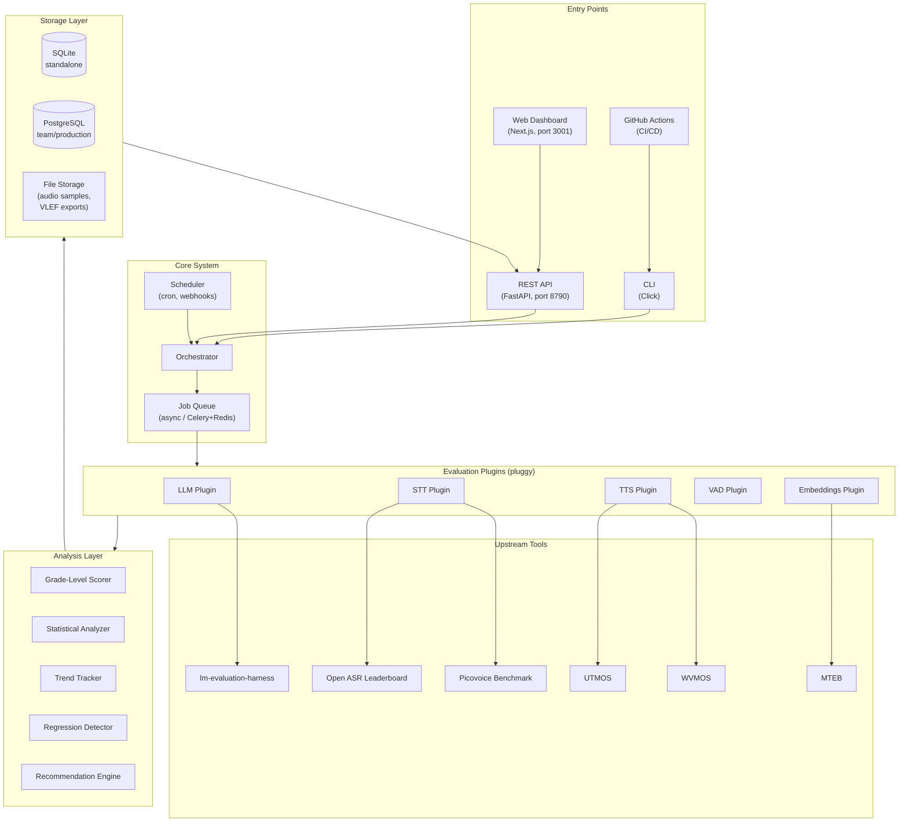
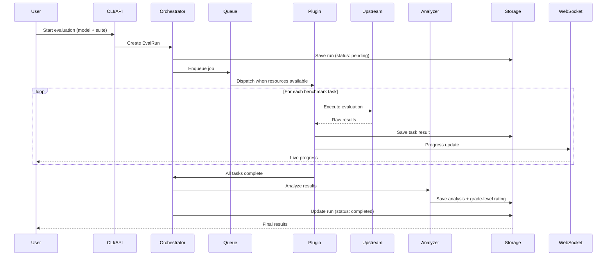
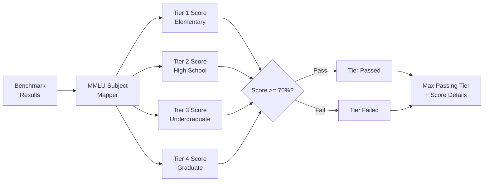

# System Architecture Overview

## Design Principles

1. **Standalone-first**: No hard dependencies on UnaMentis internals. Anyone can install and use this independently.
2. **CLI-first**: Every operation available via the command line for automation and CI/CD.
3. **Pluggable backends**: Evaluation engines (lm-eval-harness, Open ASR, UTMOS) are plugins that can be added, removed, or replaced.
4. **Education-native**: Grade-level assessment is a first-class concept, not an afterthought.
5. **Shareable**: Results use a portable format (VLEF) for sharing between teams and installations.

## High-Level Architecture



## Component Details

### 1. Entry Points

**CLI (Click-based)**
Primary interface for automation and power users. All operations, including running evaluations, querying results, comparing models, and launching the web server, are CLI commands. See [CLI_DESIGN.md](CLI_DESIGN.md).

**FastAPI Backend (Port 8790)**
REST API with auto-generated OpenAPI documentation. Serves the web dashboard and supports external integrations. Includes WebSocket endpoint for live progress updates during evaluations. See [API_DESIGN.md](API_DESIGN.md).

**Next.js Web Dashboard (Port 3001)**
Rich, interactive dashboard for browsing results, comparing models, and managing evaluations. Communicates with the FastAPI backend. See [WEB_DASHBOARD.md](WEB_DASHBOARD.md).

**GitHub Actions**
CI/CD integration for automated evaluation triggered by new model releases or on a schedule. Uses the CLI in `--ci` mode with non-zero exit codes on failures.

### 2. Core System

**Orchestrator**
Central coordinator for evaluation runs. Responsibilities:
- Validate evaluation requests (model exists, benchmarks are compatible)
- Create `EvalRun` records with status tracking
- Dispatch work to the appropriate plugins via the job queue
- Collect results and trigger analysis
- Broadcast progress updates via WebSocket

**Scheduler**
Manages recurring evaluations:
- Cron-based scheduling (e.g., weekly full benchmark runs)
- Webhook triggers (e.g., HuggingFace new model notification)
- On-import triggers (evaluate any newly registered model)

**Job Queue**
Manages GPU-bound evaluation work:
- **Development mode:** asyncio-based, sequential execution
- **Production mode:** Celery + Redis for distributed workers
- Priority levels: urgent (user-initiated) > scheduled > background
- GPU memory-aware scheduling (won't start a 7B evaluation if a 70B is running)

### 3. Evaluation Plugins

Each plugin wraps one or more upstream evaluation tools. Plugins are discovered via Python entry points (setuptools) and managed through pluggy hooks. See [PLUGIN_SYSTEM.md](PLUGIN_SYSTEM.md).

| Plugin | Upstream Tool(s) | Model Types | Key Metrics |
|--------|-----------------|-------------|-------------|
| LLM | lm-evaluation-harness, DeepEval | LLM | Accuracy, F1, exact match per benchmark |
| STT | Open ASR Leaderboard, Picovoice | STT | WER, domain WER, RTFx, latency |
| TTS | UTMOS, WVMOS, jiwer | TTS | MOS, pronunciation accuracy, intelligibility WER |
| VAD | Custom pipeline | VAD | Detection accuracy, false positive rate, latency |
| Embeddings | MTEB | Embeddings | Retrieval accuracy, clustering quality |

### 4. Analysis Layer

**Grade-Level Scorer**
Maps benchmark results to education tiers. Uses MMLU subject groupings, TutorBench scores, and custom thresholds to assign a "maximum passing tier" to each model. See [GRADE_LEVEL_SYSTEM.md](../benchmarks/GRADE_LEVEL_SYSTEM.md).

**Statistical Analyzer**
Computes aggregate scores, confidence intervals, and per-benchmark breakdowns. Normalizes scores across different benchmark types for cross-model comparison.

**Trend Tracker**
Tracks model performance over time within model families (e.g., Qwen 1.5, 2.0, 2.5). Detects capability improvements and regression across releases.

**Regression Detector**
Compares new evaluation results against baselines. Flags regressions with severity levels (minor: 10-20%, moderate: 20-50%, severe: >50%).

**Recommendation Engine**
Generates deployment recommendations based on evaluation results:
- Best model for a given deployment target (on-device, server, cloud)
- Best model for a given education tier
- Quality/performance/cost trade-off recommendations

### 5. Storage Layer

**SQLite (Default)**
Zero-configuration storage for individual users and standalone deployments. Single file, no server process required. See [DATA_MODEL.md](DATA_MODEL.md) for the complete schema.

**PostgreSQL (Team/Production)**
Same schema, deployed to PostgreSQL for multi-user, concurrent access. Required when multiple evaluation workers run in parallel.

**File Storage**
Stores artifacts that don't belong in the database:
- TTS audio samples (WAV files generated during evaluation)
- VLEF export files
- Custom test set audio (STT domain vocabulary recordings)
- Generated reports (PDF/HTML)

## Data Flow

### Evaluation Run Lifecycle



### Grade-Level Assessment Flow



## Deployment Modes

### 1. Local Development
```bash
voicelearn-eval serve
# Starts FastAPI on :8790 + Next.js on :3001
# Uses SQLite in ~/.voicelearn-eval/data.db
```

### 2. Docker Single-Host
```yaml
# docker-compose.yml
services:
  api:
    build: .
    ports: ["8790:8790"]
    volumes: ["./data:/data"]
  web:
    build: ./web
    ports: ["3001:3001"]
  worker:  # Optional: for background evaluations
    build: .
    command: celery -A voicelearn_eval.worker worker
  redis:   # Optional: for job queue
    image: redis:7-alpine
```

### 3. CI/CD Pipeline
```yaml
# .github/workflows/evaluate.yml
- name: Evaluate model
  run: |
    pip install edu-voice-ai-eval
    voicelearn-eval run --model ${{ inputs.model }} --suite education_focus --ci
```

## Security Considerations

- API keys for cloud models are referenced by environment variable name, never stored in the database
- Share links use cryptographically random tokens
- No authentication by default (local tool), optional auth for team deployments
- Audio samples stored locally, never uploaded to external services
- VLEF exports contain only scores and metadata, not raw model outputs
